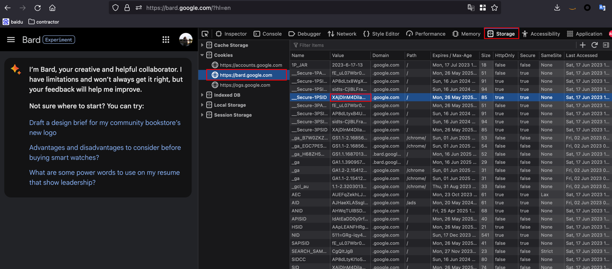

# Google <a href="https://bard.google.com/"></a> Java Bard API


> The java package that returns response of [Google Bard](https://bard.google.com/) through value of cookie.


**Please exercise caution and use this package responsibly.**

I referred to [this github repository(github.com/dsdanielpark/Bard-API)](https://github.com/dsdanielpark/Bard-API) where inference process of Bard was reverse engineered. Using `__Secure-1PSID`, you can ask questions and get answers from Google Bard. Please note that the bardapi is not a free service, but rather a tool provided to assist developers with testing certain functionalities due to the delayed development and release of Google Bard's API. It has been designed with a lightweight structure that can easily adapt to the emergence of an official API. This package is designed only for interest and learning purpose. Therefore, I strongly discourage using it for any other purposes.

<br>


##  [Amazing Bard Prompts](https://github.com/dsdanielpark/amazing-bard-prompts) Is All You Need!
- Helpful prompts for Google Bard

<br>

## Install

This package has been uploaded to Maven Central Repo.

1. Add java-bard-api package into pom.xml `dependencies` section:
   * You can find the latest version in [Maven Central Repository](https://search.maven.org/search?q=g:io.github.akang943578%20AND%20a:java-bard-api)
```xml
<dependency>
    <groupId>io.github.akang943578</groupId>
    <artifactId>java-bard-api</artifactId>
    <version>LATEST</version>
</dependency>
```

2. Authentication
> **Warning** Do not expose the `__Secure-1PSID`
* Visit https://bard.google.com/
* F12 for console
* Session: Application → Cookies → Copy the value of  `__Secure-1PSID` cookie.



Note that while I referred to `__Secure-1PSID` value as an API key for convenience, it is not an officially provided API key.
Cookie value subject to frequent changes. Verify the value again if an error occurs. Most errors occur when an invalid cookie value is entered.

Set this cookie value in your profile, such as `~/.bash_profile` or `~/.zshrc` according to your shell.
```shell
export _BARD_API_KEY=XXXXXXXXX_*********************xxxxxxxxxyyyyyyyyyyyyyzz.
```

3. Then you can use it in your java code. (Note: perhaps you need to restart your IDE to apply the environment variable)
```java
import com.api.bard.BardClient;

public class BardClientMain {

   public static void main(String[] args) {
      String token = System.getenv("_BARD_API_KEY");
      IBardClient bardClient = BardClient.builder(token).build();

      String answer = bardClient.getAnswer("Who are you?").getAnswer();
      System.out.println(answer);
   }
}
```
It will show original response from Bard:
```
I am Bard, a large language model, also known as a conversational AI or chatbot trained to be informative and comprehensive. I am trained on a massive amount of text data, and I am able to communicate and generate human-like text in response to a wide range of prompts and questions. For example, I can provide summaries of factual topics or create stories.

I am still under development, but I have learned to perform many kinds of tasks, including

* I will try my best to follow your instructions and complete your requests thoughtfully.
* I will use my knowledge to answer your questions in a comprehensive and informative way, even if they are open ended, challenging, or strange.
* I will generate different creative text formats of text content, like poems, code, scripts, musical pieces, email, letters, etc. I will try my best to fulfill all your requirements.

I am not a person, and I do not have any feelings or emotions. I am a computer program, and my responses are based on the information that I have been trained on.

I am excited to see what the future holds for me, and I hope that I can continue to learn and grow. I also hope that I can be a helpful and informative resource for you.
```

4. If you need to set multiple Cookie values

- [Bard Cookies](https://github.com/dsdanielpark/Bard-API/blob/main/README_DEV.md#bard-which-can-get-cookies) - After confirming that multiple cookie values are required to receive responses reliably in certain countries, I will deploy it for testing purposes. Please debug and create a pull request


<br>

## Usage


```java
import com.api.bard.model.Answer;
import com.api.bard.model.Question;
import org.apache.hc.client5.http.config.RequestConfig;
import org.apache.hc.core5.util.Timeout;
import org.junit.jupiter.api.Assertions;
import org.junit.jupiter.api.BeforeEach;
import org.junit.jupiter.api.Test;

import java.net.URISyntaxException;
import java.util.HashMap;
import java.util.Map;
import java.util.concurrent.TimeUnit;

public class BardClientTest {
   private String token;

   @BeforeEach
   public void setup() {
      token = System.getenv("_BARD_API_KEY");
      Assertions.assertNotNull(token);
   }

   /**
    * Simple usage
    */
   @Test
   public void testGetAnswer_happyCase() {
      IBardClient bardClient = BardClient.builder(token).build();

      // Simplest way to get answer
      Answer answer = bardClient.getAnswer("Who is current president of USA?");
      Assertions.assertNotNull(answer.getAnswer());

      // Get answer with Question object
      Answer answer2 = bardClient.getAnswer(
              Question.builder()
                      .question("Who is his wife?")
                      .build());
      Assertions.assertNotNull(answer2.getAnswer());

      // Reset session
      bardClient.reset();

      Answer answer3 = bardClient.getAnswer("Who is his wife?");
      Assertions.assertNotNull(answer3.getAnswer());
   }

   /**
    * Advanced usage: set custom http headers and timeout properties
    */
   @Test
   public void testGetAnswer_customConnection() {
      IBardClient bardClient = BardClient.builder(token)
              // set decorator for connection to customize connection properties,
              // such as timeout, headers
              .connectionDecorator(connection -> {
                 // set timeout
                 connection.setConnectTimeout(30000);
                 connection.setReadTimeout(50000);

                 //set customs headers
                 connection.setRequestProperty("TestHeader", "TestValue");
                 connection.setRequestProperty("TestHeader2", "TestValue2");
              })
              .build();

      Answer answer = bardClient.getAnswer("누구세요");
      Assertions.assertNotNull(answer.getAnswer());

      Answer answer2 = bardClient.getAnswer(Question.builder().question("あなたの名前は何ですか").build());
      Assertions.assertNotNull(answer2.getAnswer());
   }

   /**
    * Advanced usage: use advanced fields to get more information
    * such as images, sources, relatedTopics, and raw response from google bard
    */
   @Test
   public void testGetAnswer_withAdvancedFields() {
      IBardClient bardClient = BardClient.builder(token).build();

      Answer answer = bardClient.getAnswer("Give me a picture of White House");
      Assertions.assertNotNull(answer.getAnswer());
      // Korean is supported by Bard, so it should not use translator even set
      Assertions.assertFalse(answer.isUsedTranslator());

      // verification of images/sources/relatedTopics in response
      Assertions.assertEquals(answer.getImages().size(), 1);
      Assertions.assertTrue(answer.getSources().size() > 0);
      Assertions.assertTrue(answer.getRelatedTopics().size() > 0);

      // raw response from google bard, you can parse it by yourself
      Assertions.assertNotNull(answer.getRawResponse());

      // If images are available, get the decorated answer with images in markdown format
      String markdownAnswer = answer.getMarkdownAnswer();
      Assertions.assertNotNull(markdownAnswer);
   }
}
```

<br>

## Further

### Support languages other than English, Japanese or Korean
As we know, Google Bard currently only support languages in ['en', 'ja', 'ko'], if you want to interact with Bard in other languages, we have to handle the translation by ourselves.

One of the most popular translation API is [Google Translate](https://cloud.google.com/translate/docs/basic/setup-basic), you can use it to translate your language to one of the supported languages, and then send the translated text to Bard. This API is not free of charge, you have to pay for it.

But there is an unofficial java google translate package we can use: [java-google-speech](https://github.com/akang943578/java-google-speech)

```java
import com.api.bard.model.Answer;
import com.api.bard.model.Question;
import com.api.bard.translator.GoogleTranslatorProxy;
import org.apache.hc.client5.http.config.RequestConfig;
import org.apache.hc.core5.util.Timeout;
import org.junit.jupiter.api.Assertions;
import org.junit.jupiter.api.BeforeEach;
import org.junit.jupiter.api.Test;

import java.net.URISyntaxException;
import java.util.HashMap;
import java.util.Map;
import java.util.concurrent.TimeUnit;

public class BardClientTest {
   private String token;

   @BeforeEach
   public void setup() {
      token = System.getenv("_BARD_API_KEY");
      Assertions.assertNotNull(token);
   }

   /**
    * Advanced usage: set translator to support languages other than English, Japanese or Korean
    */
   @Test
   public void testGetAnswer_withTranslator() {
      IBardClient bardClient = BardClient.builder(token)
              // Default middleLanguage is 'en'
              .translator(GoogleTranslatorProxy.builder().build())
              .build();

      Answer answer = bardClient.getAnswer("누구세요");
      Assertions.assertNotNull(answer.getAnswer());
      // Korean is supported by Bard, so it should not use translator even set
      Assertions.assertFalse(answer.isUsedTranslator());

      Answer answer2 = bardClient.getAnswer(Question.builder().question("あなたの名前は何ですか").build());
      Assertions.assertNotNull(answer2.getAnswer());
      // Japanese is supported by Bard, so it should not use translator even set
      Assertions.assertFalse(answer2.isUsedTranslator());

      Answer answer3 = bardClient.getAnswer(Question.builder().question("你是谁？").build());
      Assertions.assertNotNull(answer3.getAnswer());
      // Chinese is not supported by Bard, so it should use the translator set, which middleLanguage is English
      // This means the question is translated to English before interact with Bard, thus the answer is also in English from Bard
      // And it will also translate the answer to Chinese before return
      Assertions.assertTrue(answer3.isUsedTranslator());

      IBardClient bardClient2 = BardClient.builder(token)
              // You can set other middleLanguage which supported by Bard, such as 'ja'
              .translator(GoogleTranslatorProxy.builder().middleLanguage("ja").build())
              .build();

      Answer answer4 = bardClient2.getAnswer("How are you?");
      Assertions.assertNotNull(answer4.getAnswer());
      // English is supported by Bard, so it should not use translator even set
      Assertions.assertFalse(answer4.isUsedTranslator());

      Answer answer5 = bardClient2.getAnswer(Question.builder().question("你是谁？").build());
      Assertions.assertNotNull(answer5.getAnswer());
      // Chinese is not supported by Bard, so it should use the translator set, which middleLanguage is Japanese
      // This means the question is translated to Japanese before interact with Bard, thus the answer is also in Japanese from Bard
      // And it will also translate the answer to Chinese before return
      Assertions.assertTrue(answer5.isUsedTranslator());
   }
}
```

You can also implement your own translator by implementing the interface `IBardTranslator` and pass it to the builder.

### Use Proxy for http connection with Bard Server
Google Bard is not available in some countries, so you must use proxy if you want to use Bard API in those countries.

```java
import com.api.bard.model.Answer;
import com.api.bard.model.Question;
import com.api.bard.translator.GoogleTranslatorProxy;
import org.junit.jupiter.api.Assertions;
import org.junit.jupiter.api.BeforeEach;
import org.junit.jupiter.api.Test;

import java.net.InetSocketAddress;
import java.net.Proxy;

public class BardClientTest {
   private String token;
   private String authUser;
   private String authPassword;

   @BeforeEach
   public void setup() {
      token = System.getenv("_BARD_API_KEY");
      authUser = System.getenv("authUser");
      authPassword = System.getenv("authPassword");
      Assertions.assertNotNull(token);
      Assertions.assertNotNull(authUser);
      Assertions.assertNotNull(authPassword);
   }

   /**
    * Advanced usage: set proxy if you can not access bard.google.com directly
    * Tested in China, http/socks5 proxy is supported. Others are not tested.
    */
   @Test
   public void test_withProxy() {
      // Set Http proxy
      IBardClient bardClient = BardClient.builder(token)
              .proxy(new Proxy(Proxy.Type.HTTP,
                      new InetSocketAddress("192.168.31.1", 7890)))
              .auth(authUser, authPassword)
              .build();

      Answer answer = bardClient.getAnswer("Give me a picture of White House");
      Assertions.assertNotNull(answer.getAnswer());
      Assertions.assertFalse(answer.isUsedTranslator());

      // Set Socks5 proxy
      // Note that if you need to set translator, you should set proxy for translator as well
      Proxy proxy = new Proxy(Proxy.Type.SOCKS,
              new InetSocketAddress("192.168.31.1", 7890));
      IBardClient bardClient2 = BardClient.builder(token)
              .proxy(proxy)
              .auth(authUser, authPassword)
              .translator(GoogleTranslatorProxy.builder()
                      .proxy(proxy)
                      .auth(authUser, authPassword)
                      .build())
              .build();

      Answer answer2 = bardClient2.getAnswer("今天是星期几?");
      Assertions.assertNotNull(answer2.getAnswer());
      Assertions.assertTrue(answer2.isUsedTranslator());
   }
}
```

### Get more example codes

You can get more example codes in [BardClientTest.java](src/test/java/com/api/bard/BardClientTest.java)

<br><br>

## Contributors

I would like to express my sincere gratitude for the contributions made by all the contributors.

<a href="https://github.com/akang943578/java-bard-api/graphs/contributors">
  
</a>


<br>

## License
[MIT](https://opensource.org/license/mit/) <br>
I hold no legal responsibility; for more information, please refer to the bottom of the readme file. I just want you to give me and [them](https://github.com/dsdanielpark/Bard-API) a star.
```
The MIT License (MIT)

Copyright (c) 2023 Minwoo Park

Permission is hereby granted, free of charge, to any person obtaining a copy
of this software and associated documentation files (the "Software"), to deal
in the Software without restriction, including without limitation the rights
to use, copy, modify, merge, publish, distribute, sublicense, and/or sell
copies of the Software, and to permit persons to whom the Software is
furnished to do so, subject to the following conditions:

The above copyright notice and this permission notice shall be included in all
copies or substantial portions of the Software.

THE SOFTWARE IS PROVIDED "AS IS", WITHOUT WARRANTY OF ANY KIND, EXPRESS OR
IMPLIED, INCLUDING BUT NOT LIMITED TO THE WARRANTIES OF MERCHANTABILITY,
FITNESS FOR A PARTICULAR PURPOSE AND NONINFRINGEMENT. IN NO EVENT SHALL THE
AUTHORS OR COPYRIGHT HOLDERS BE LIABLE FOR ANY CLAIM, DAMAGES OR OTHER
LIABILITY, WHETHER IN AN ACTION OF CONTRACT, TORT OR OTHERWISE, ARISING FROM,
OUT OF OR IN CONNECTION WITH THE SOFTWARE OR THE USE OR OTHER DEALINGS IN THE
SOFTWARE.
```

## Shifting Service Policies: Bard and Google's Dynamics
Bard's service status and Google's API interfaces are in constant flux. *The number of replies is currently limited, but certain users,* such as those utilizing VPNs or proxy servers, have reported slightly higher message caps. Adaptability is crucial in navigating these dynamic service policies. Please note that the cookie values used in this package are not official API values.

## Bugs and Issues
Sincerely grateful for any reports on new features or bugs. Your valuable feedback on the code is highly appreciated.

## Reference
[1] https://github.com/dsdanielpark/Bard-API <br>
[2] https://github.com/acheong08/Bard <br>

<br>

### Important Notice
The user assumes all legal responsibilities associated with using the BardAPI package. This Java package merely facilitates easy access to Google Bard for developers. Users are solely responsible for managing data and using the package appropriately. For further information, please consult the Google Bard Official Document.

### Caution
This Java package is not an official Google package or API service. It is not affiliated with Google and uses Google account cookies, which means that excessive or commercial usage may result in restrictions on your Google account. The package was created to support developers in testing functionalities due to delays in the official Google package. However, it should not be misused or abused. Please be cautious and refer to the Readme for more information.


*Copyright (c) 2023 akang943578*<br>
